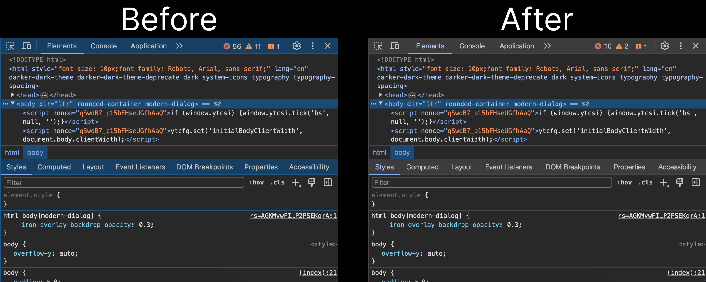

# Revert DevTools

In 2024, Chrome redesigned its DevTools. I personally believe the redesign was a downgrade.

This extension allows you to restore DevTools to its previous design in newer versions of Chrome.

# Get

Chrome Web Store

**Important:** By default, DevTools doesn't load custom themes created by browser extensions. To enable this:

1. Open DevTools.
2. Open the **Settings** page by pressing `F1`.
3. In the sidebar, click **Experiments**.
4. Enable **Allow extensions to load custom stylesheets**.
5. Close the **Settings** page and reload DevTools.
